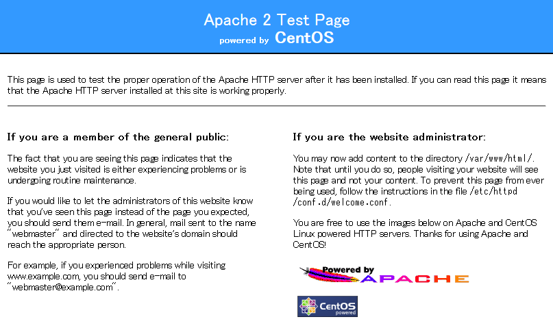
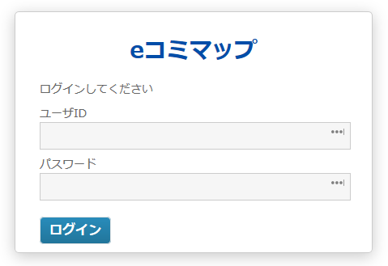

.. _install:

=================================
 3 eコミマップのインストール手順
=================================

3.1 eコミマップインストール用ディレクリ作成
===========================================

.. code-block:: console
   :emphasize-lines: 1

      $ sudo mkdir -p /home/map/webapps/map/WEB-INF

3.2 eコミマップ用 GeoServer インストール
========================================

.. code-block:: console
   :emphasize-lines: 1-2,4,6-

      $ cd ~
      $ pwd
      /home/admin
      $ unzip geoserver-2.3.5-bin.zip
      -- 省略 --
      $ cd geoserver-2.3.5
      $ rm -f lib/jetty-*
      $ rm -f lib/servlet-api-2.5
      $ rm -f webapps/geoserver/WEB-INF/lib/gwc-*
      $ rm -f webapps/geoserver/WEB-INF/lib/web-gwc-*
      $ rm -f data_dir/layergroups/*
      $ rm -rf data_dir/workspaces/cite/
      $ rm -rf data_dir/workspaces/it.geosolutions/
      $ rm -rf data_dir/workspaces/nurc/
      $ rm -rf data_dir/workspaces/sde/
      $ rm -rf data_dir/workspaces/sf/
      $ rm -rf data_dir/workspaces/tiger/
      $ rm -rf data_dir/workspaces/topp/
      $ rm -f lib/commons-logging-1.0.jar
      $ cp webapps/geoserver/WEB-INF/lib/commons-logging-1.1.1.jar lib/
      $ cd ..
      $ sudo cp -r geoserver-2.3.5 /home/map/geoserver

3.3 GeoServer の不要なライブリファル削除
========================================

3.2 で実行済

3.4 ライブリファルの置き換え
============================

3.2 で実行済

3.5 GeoServer の不要なサンプルデータファイルの削除
================================================

3.2 で実行済、インストール手順には単にエラーメッセージの抑制との記述がありますが、
この問題を放置するとeコミマップが立ち上がりません。

3.6 eコミマップ用の JavaScript ライブラリとフォントのインストール
=============================================================

OpenLayers
----------

.. code-block:: console
   :emphasize-lines: 1-2,4,5,7-

      $ cd ~
      $ pwd
      /home/admin
      $ curl -L -O https://github.com/openlayers/ol2/releases/download/release-2.13.1/OpenLayers-2.13.1.tar.gz
      $ tar xvfz OpenLayers-2.13.1.tar.gz
      -- 省略 --
      $ sudo cp -r  OpenLayers-2.13.1 /home/map/webapps/map/OpenLayers

Dojo Toolkit
------------

* ここに到達するときは /home/map/webapps/map まで作成済なはずです
* インストール先が dojo-1.9 決め打ちになるので注意してください

.. code-block:: console
   :emphasize-lines: 1-2,4,8,10-
                     
      $ cd ~
      $ pwd
      /home/admin
      $ curl -L -O https://download.dojotoolkit.org/release-1.9.4/dojo-release-1.9.4.tar.gz
      % Total    % Received % Xferd  Average Speed   Time    Time     Time  Current
                                         Dload  Upload   Total   Spent    Left  Speed
        100 8465k  100 8465k    0     0  1153k      0  0:00:07  0:00:07 --:--:-- 1767k
      $ tar xvzf dojo-release-1.9.4.tar.gz
      -- 省略 --
      $ sudo mkdir /home/map/webapps/map/js
      $ sudo cp -r dojo-release-1.9.4 /home/map/webapps/map/js/dojo-1.9

IPA フォント
------------

.. code-block:: console
   :emphasize-lines: 1-2,4,8-9,17

      $ cd ~
      $ pwd
      /home/admin
      $ curl -L -O "https://ja.osdn.net/frs/redir.php?m=iij&f=%2Fipafonts%2F51868%2FIPAfont00303.zip"
        % Total    % Received % Xferd  Average Speed   Time    Time     Time  Current
                                       Dload  Upload   Total   Spent    Left  Speed
      100 19.1M  100 19.1M    0     0  1828k      0  0:00:10  0:00:10 --:--:-- 1757k
      $ mv redir.php* IPAfont00303.zip
      $ unzip IPAfont00303.zip
      Archive:  IPAfont00303.zip
      inflating: IPAfont00303/IPA_Font_License_Agreement_v1.0.txt
      inflating: IPAfont00303/ipag.ttf
      inflating: IPAfont00303/ipagp.ttf
      inflating: IPAfont00303/ipam.ttf
      inflating: IPAfont00303/ipamp.ttf
      inflating: IPAfont00303/Readme_IPAfont00303.txt
      $ sudo cp -r IPAfont00303 /home/map/webapps/map/WEB-INF/fonts

3.7 eコミマップパケージファイルのコピーと解凍
=============================================

.. code-block:: console
   :emphasize-lines: 1-2,4

   $ cd ~
   $ pwd
   /home/admin
   $ sudo tar xvfz ecommap-installer-2.4.2.tar.gz -C /home/map

3.8 Web サーバとポートの設定
============================

リンクローカルアドレスの確認
----------------------------

VirtualBox で動いている仮想サーバーの **リンクローカルアドレス** を確認します。今回は名前引きしないので、
ここでとれた IP アドレス（以下の例では 192.168.56.101）をそのままブラウザの URL に使用
することにします。 192.168.56.101 とは違う IP アドレスが出てくるかもしれませんが、
そのときは読み替えてください。

.. code-block:: console
   :emphasize-lines: 1

   $ ifconfig | grep -2 eth1 | grep 'inet addr'
             inet addr:192.168.56.101  Bcast:192.168.56.255  Mask:255.255.255.0
             
mod_proxy の設定
----------------

jetty はポート 8080 でリクエストを受け付けますが、80 番ポートにするために apache
から 8080 ポートに問い合わせるようにします。
192.168.56.101 は先ほど調べたリンクローカルアドレスです。リンクローカルアドレスがこれとは違う
IP アドレスのときもあります。

.. code-block:: console
   :emphasize-lines: 1

   $ sudo /home/map/proxypass.sh 192.168.56.101 > /etc/httpd/conf.d/ecommap.conf

192.168.56.101 （リンクローカルアドレス）の代わりに localhost とするとどうなるのか
~~~~~~~~~~~~~~~~~~~~~~~~~~~~~~~~~~~~~~~~~~~~~~~~~~~~~~~~~~~~~~~~~~~~~~~~~~~~~~~~~~

e コミマップログイン画面直後に http://localhost/map となり、画面遷移がうまくいきません。
ここで http://192.168.56.101/map/ とすれば、使用可能です。

apache の ServerName の設定
---------------------------

ServerName がないと怒られるので設定します。エディタで ServerName geoint:80 を追加します。

.. code-block:: console
   :emphasize-lines: 1

   $ sudo gedit /etc/httpd/conf/httpd.conf

/etc/httpd/conf/httpd.conf

.. code-block:: console
   :emphasize-lines: 15

   略
   #
   # ServerName gives the name and port that the server uses to identify itself.
   # This can often be determined automatically, but we recommend you specify
   # it explicitly to prevent problems during startup.
   #
   # If this is not set to valid DNS name for your host, server-generated
   # redirections will not work.  See also the UseCanonicalName directive.
   #
   # If your host doesn't have a registered DNS name, enter its IP address here.
   # You will have to access it by its address anyway, and this will make
   # redirections work in a sensible way.
   #
   #ServerName www.example.com:80
   ServerName geoint:80
   略

編集が終わったら

.. code-block:: console
   :emphasize-lines: 1

   $ sudo service httpd restart
   httpd を停止中:                                            [  OK  ]
   httpd を起動中:                                            [  OK  ]

再起動しても起動するようにします

.. code-block:: console
   :emphasize-lines: 1

   $ sudo chkconfig httpd on

httpd （apache）の動作確認
--------------------------

http://192.168.56.101 としてブラウザでみます。CentOS のテストページが出れば ok です。

   CentOS のテストページ

3.9 e コミマップ用データベースの作成
====================================

postgres の管理者権限はユーザー postgres なので、 ユーザー postgres に化けます。
さらに、postgres データベースの中だけのユーザー名 mapuser を eコミマップのデータベースを扱う
用途のためにつくります。そして mapuser に e コミマップのための最低限の権限を与えます。

ユーザー postgres はすべてのデータベースの削除までできる強い権限があるので、
必要な時だけ使うことにします。

.. code-block:: console
   :emphasize-lines: 1-6,10,12,14,16,25-27

   $ sudo su - postgres
   -bash-4.1$ cd
   -bash-4.1$ createuser mapuser -S -d -R -l --password
   パスワード:geoint
   -bash-4.1$ createdb ecommap -U mapuser -E UTF-8
   -bash-4.1$ psql -U postgres ecommap
   psql (9.6.1)
   "help" でヘルプを表示します.
   
   ecommap=# grant all on database ecommap to mapuser;
   GRANT
   ecommap=# grant all on geometry_columns to mapuser;
   GRANT
   ecommap=# grant all on spatial_ref_sys to mapuser;
   GRANT
   ecommap=# \d
                     リレーションの一覧
   スキーマ |       名前        |    型    |  所有者
   ----------+-------------------+----------+----------
   public   | geography_columns | ビュー   | postgres
   public   | geometry_columns  | ビュー   | postgres
   public   | spatial_ref_sys   | テーブル | postgres
   (3 行)
   
   ecommap=# \q
   -bash-4.1$ exit
   logout
   $

3.10 e コミマップの起動
=======================

SELinux を無効
--------------

今この瞬間から SELinux を無効にします。

.. code-block:: console
   :emphasize-lines: 1

   $ sudo setenforce 0

再起動しても SELnux を無効になるようにしてしまいます。

.. code-block:: console
   :emphasize-lines: 1

   $ sudo gedit /etc/selinux/config

/etc/selinux/config

.. code-block:: console
   :emphasize-lines: 6

   # This file controls the state of SELinux on the system.
   # SELINUX= can take one of these three values:
   #     enforcing - SELinux security policy is enforced.
   #     permissive - SELinux prints warnings instead of enforcing.
   #     disabled - No SELinux policy is loaded.
   SELINUX=disabled
   # SELINUXTYPE= can take one of these two values:
   #     targeted - Targeted processes are protected,
   #     mls - Multi Level Security protection.
   SELINUXTYPE=targeted

起動
----
   
_option は存在しませんなどエラーが出力されてますが、 **これで正常** です。これらの
エラーは、 GUI でのインストール設定時にテーブルを作成後解消されます。

.. code-block:: console
   :emphasize-lines: 1-2

   $ cd /home/map/geoserver/bin
   $ sudo sh ./startup.sh
   The JAVA_HOME environment variable is not defined
   GEOSERVER_HOME environment variable not found, using current
   location.  If not set then running this script from other
   directories will not work in the future.
   GEOSERVER DATA DIR is /home/map/geoserver/bin/../data_dir
   1 [main] INFO org.mortbay.log - Logging to org.slf4j.impl.SimpleLogger@6a22a6bb via org.mortbay.log.Slf4jLog
   413 [main] WARN org.mortbay.log - Deprecated configuration used for /home/map/geoserver/webapps
   458 [main] WARN org.mortbay.log - Deprecated configuration used for ../webapps
   459 [main] INFO org.mortbay.log - jetty-6.1.26
   3494 [main] INFO /geoserver - Initializing Spring root WebApplicationContext
   07 2 23:12:03 WARN [config.CustomEditorConfigurer] - Passing PropertyEditor instances into CustomEditorConfigurer is deprecated: use PropertyEditorRegistrars or PropertyEditor class names instead. Offending key [org.
   geotools.util.Version; offending editor instance: org.geoserver.platform.util.VersionPropertyEditor@4cc7636f
   07 2 23:12:04 WARN [org.geoserver] - No default workspace was found.
   07 2 23:12:04 WARN [org.geoserver] - Ignoring store directory 'map'
   07 2 23:12:05 WARN [security.impl] - Namespace/Workspace map is unknown in rule map.*.w=ROLE_WFS_WRITE
   07 2 23:12:30 WARN [geoserver.security] - Strong cryptograhpy is NOT available
   Download and install of policy files recommended
   from http://www.oracle.com/technetwork/java/javase/downloads/jce-6-download-429243.html
   37368 [main] INFO org.mortbay.log - org.mortbay.jetty.plus.webapp.Configuration does not support annotations on source. Use org.mortbay.jetty.annotations.Configuration instead
   37370 [main] INFO org.mortbay.log - No Transaction manager found - if your webapp requires one, please configure one.
   org.postgresql.util.PSQLException: ERROR: リレーション"_option"は存在しません
   Position: 26
        at org.postgresql.core.v3.QueryExecutorImpl.receiveErrorResponse(QueryExecutorImpl.java:2062)
        at org.postgresql.core.v3.QueryExecutorImpl.processResults(QueryExecutorImpl.java:1795)
        at org.postgresql.core.v3.QueryExecutorImpl.execute(QueryExecutorImpl.java:257)
        at org.postgresql.jdbc2.AbstractJdbc2Statement.execute(AbstractJdbc2Statement.java:479)
        at org.postgresql.jdbc2.AbstractJdbc2Statement.executeWithFlags(AbstractJdbc2Statement.java:367)
        at org.postgresql.jdbc2.AbstractJdbc2Statement.executeQuery(AbstractJdbc2Statement.java:271)
        at sun.reflect.NativeMethodAccessorImpl.invoke0(Native Method)
        at sun.reflect.NativeMethodAccessorImpl.invoke(NativeMethodAccessorImpl.java:57)
        at sun.reflect.DelegatingMethodAccessorImpl.invoke(DelegatingMethodAccessorImpl.java:43)
        at java.lang.reflect.Method.invoke(Method.java:606)
        at org.postgresql.ds.jdbc23.AbstractJdbc23PooledConnection$StatementHandler.invoke(AbstractJdbc23PooledConnection.java:455)
        at com.sun.proxy.$Proxy16.executeQuery(Unknown Source)
        at jp.ecom_plat.map.db.MapDB.getOption(MapDB.java:509)
        at jp.ecom_plat.map.db.MapDB.getOption(MapDB.java:456)
        at jp.ecom_plat.map.osw.CswUpdateCheckThread.checkCswUpdate(CswUpdateCheckThread.java:95)
        at jp.ecom_plat.map.osw.CswUpdateCheckThread.run(CswUpdateCheckThread.java:306)
   org.postgresql.util.PSQLException: ERROR: リレーション"_community"は存在しません
   Position: 15
        at org.postgresql.core.v3.QueryExecutorImpl.receiveErrorResponse(QueryExecutorImpl.java:2062)
        at org.postgresql.core.v3.QueryExecutorImpl.processResults(QueryExecutorImpl.java:1795)
        at org.postgresql.core.v3.QueryExecutorImpl.execute(QueryExecutorImpl.java:257)
        at org.postgresql.jdbc2.AbstractJdbc2Statement.execute(AbstractJdbc2Statement.java:479)
        at org.postgresql.jdbc2.AbstractJdbc2Statement.executeWithFlags(AbstractJdbc2Statement.java:367)
        at org.postgresql.jdbc2.AbstractJdbc2Statement.executeQuery(AbstractJdbc2Statement.java:271)
        at sun.reflect.NativeMethodAccessorImpl.invoke0(Native Method)
        at sun.reflect.NativeMethodAccessorImpl.invoke(NativeMethodAccessorImpl.java:57)
        at sun.reflect.DelegatingMethodAccessorImpl.invoke(DelegatingMethodAccessorImpl.java:43)
        at java.lang.reflect.Method.invoke(Method.java:606)
        at org.postgresql.ds.jdbc23.AbstractJdbc23PooledConnection$StatementHandler.invoke(AbstractJdbc23PooledConnection.java:455)
        at com.sun.proxy.$Proxy16.executeQuery(Unknown Source)
        at jp.ecom_plat.map.db.MapDB.searchCommunityInfo(MapDB.java:1295)
        at jp.ecom_plat.map.osw.CswUpdateCheckThread.run(CswUpdateCheckThread.java:307)

3.12 e コミマップのインストール
===============================

先ほどのリンクローカルアドレス http://192.168.56.101/map/install をブラウザで見ます。 リンクローカルアドレスが 192.168.56.101 とは違う IP アドレスのときもあります。

3.12.1 インストール情報入力画面
-------------------------------

データベース情報

.. csv-table::
   :header-rows: 1
   :widths: 40, 6

   項目, 内容
   データベースサーバ, localhost
   データベースポート, 5432
   データベース名, ecommap
   データベースユーザ名, mapuser
   データベースユーザのパスワード, geoint

eコミマップサーバ設定
   
.. csv-table::
   :header-rows: 1
   :widths: 27, 6

   項目, 内容
   サイト名称, eコミマップ
   管理用パスワード, geoint
   ポータルサイトURL, http://localhost/map/

携帯電話登録用メールサーバ設定

.. csv-table::
   :header-rows: 1
   :widths: 30, 6

   項目, 内容
   携帯電話での登録を利用する, □ 利用する（チェックを外す）

3.12.4 インストール完了画面
---------------------------

3.10 e コミマップの起動 で入力した startup.sh を ctrl+c （コントロールキーを押しながら c）で停止します。

3.13 e コミマップの自動起動設定
===============================

eコミマップの起動スクリプトの登録
---------------------------------

.. code-block:: console
   :emphasize-lines: 1-4

   $ cd /home/map/
   $ sudo cp ecommap /etc/init.d/
   $ sudo chmod 775 /etc/init.d/ecommap
   $ sudo chkconfig ecommap on

サービスの起動
--------------

.. code-block:: console
   :emphasize-lines: 1

   $ sudo service ecommap restart

ログイン画面が出れば終了です
============================

リンクローカルアドレス http://192.168.56.101/map/ をブラウザで見ます。 リンクローカルアドレスが 192.168.56.101 とは違う IP アドレスのときもあります。ログイン画面がでましたか?

   eコミマップログイン画面
