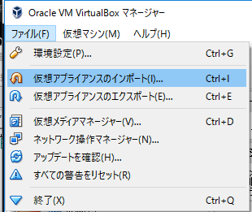
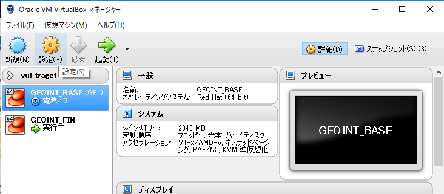
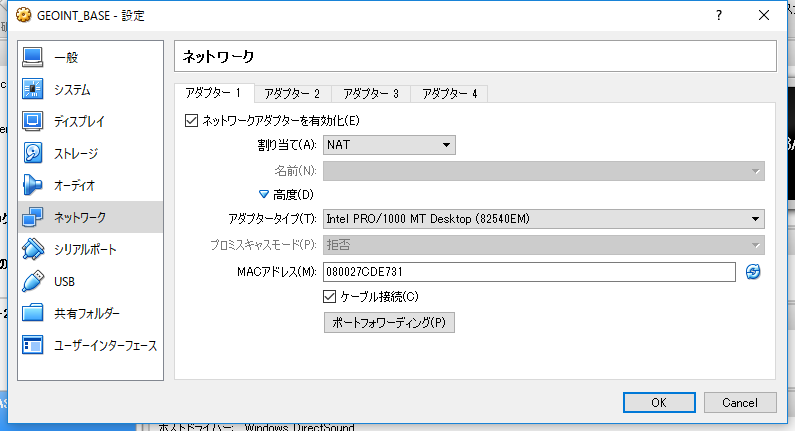
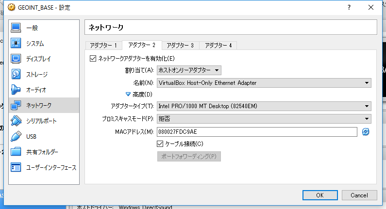
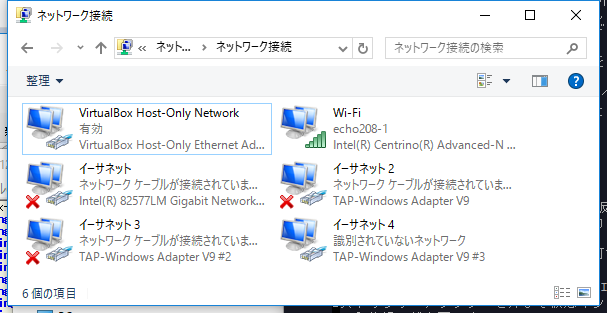

.. _virtualbox:

1 インストールの前に
==================================

e コミマップインストール用仮想マシンの作成
------------------------------------------

http://ecomi.socio/share から GEOINT_BASE.ova をダウンロードして VirtualBox **ファイル** → **仮想アプライアンスのインポート** より、VitualBox 仮想マシンを作成します。

   GEOINT_BASE のインポート

ネットワークの設定
------------------

GEOINT_BASE 仮想マシンが作成出来たら GEOINT_BASE のネットワークの設定を行います。

1. 設定したい仮想マシンをクリック（ **GEOINT_BASE** ）→ **設定**

   設定画面の出し方

2. **ネットワーク** を選択、 **アダプター 1** が表示されているので、 **割り当て** に **NAT** を選ぶ。
**高度（D）** の左の **青三角** をクリックして全部表示させる。 **MAC アドレス** *以外* の項目の一致を確認してください。一致していないときは、修正します。

   ネットワークの設定（アダプター1）図をクリックするとはっきり出ます

なお **ポートフォワーディング** の項目にはなにも設定しません。クリックする必要はありません。

3. **アダプター 2** タブを選択。**割り当て** に **ホストオンリーアダプター** を選ぶ。
**高度（D）** の左の **青三角** をクリックして全部表示させる。 **MAC アドレス** *以外* の項目の一致を確認してください。一致していないときは、修正します。

   ネットワークの設定（アダプター2）図をクリックするとはっきり出ます。

なお **ポートフォワーディング** はクリックできません。

NAT とホストオンリーアダプターの違い
------------------------------------

NAT
~~~

VirtualBox は、ダウンロード時など、外のサーバーに接続するために仮想的（ソフトウェア）なルーターを用意していて、そこに仮想的なネットワークカードを接続しています。仮想マシンからは、仮想ネットワークカードを介して外部に通信を行います。 Linux 上から NAT の仮想ネットワークカードは eth0 となります。

この仮想マシンから外へ接続する仕組みを **NAT** といいます。

しかし、VitualBox 仮想マシンから外部への一方通行なので、今回のように Web サーバーを仮想マシン上に作成したときなど、外部から仮想マシンに通信を行いたいときは別の手段を講じなければなりません。これが、次に説明する **ホストオンリーアダプター** です。

ホストオンリーアダプター
~~~~~~~~~~~~~~~~~~~~~~~~

VirtualBox をインストールした母艦に仮想的（ソフトウェア）なハブを作成し、そこに、母艦に作られた仮想ネットワークカードと、仮想マシンの仮想ネットワークカードを仮想ハブに接続することにより、母艦と仮想マシン双方向の通信を可能にします。 Linux 上かのホストオンリーアダプターの仮想ネットワークカードは eth1 となります。

この、母艦と仮想マシン双方向の通信を可能にする仕組みを、 **ホストオンリーアダプター** といいます。

仮想ネットワークカード双方に自動的に IP アドレスが割り当てられますがこれを **リンクローカルアドレス** といいます。ホストオンリーアダプターを介して仮想マシンから母艦以外の外への通信はできません。外への通信を行うためには上述の NAT という仕組みが必要です。

   母艦（Windows）上でのホストオンリーアダプター仮想ネットワークカード（左上）
